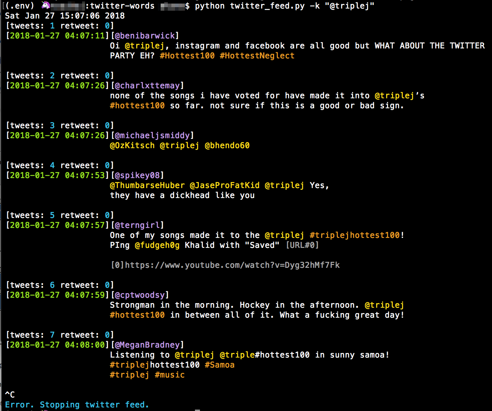

# twitter-words
Start of some ad hoc tweet analysis.

```sh
# note:
# use python3 version of virtualenv (wordcloud, matplotlib)
# installs python as framework and avoids 'python not installed as framework' runtime errors
$ python3 -m venv .env
```
```sh
usage: twitter_words.py [-h] -u USER [-c COUNT] [-rt] [-s] [-l MIN_LENGTH]
                        [-f MIN_FREQ] [-t TOP] [-wc]

optional arguments:
  -h, --help            show this help message and exit
  -u USER, --user USER  twitter user @name
  -c COUNT, --count COUNT
                        get count number of tweets
  -rt, --retweets       include retweets
  -s, --show            show count tweets
  -l MIN_LENGTH, --min_length MIN_LENGTH
                        min word length
  -f MIN_FREQ, --min_freq MIN_FREQ
                        min word frequency
  -t TOP, --top TOP     display top number of words by freq
  -wc, --wordcloud      create word cloud

```
## twitter-feed
Streaming formatted tweets to the terminal using the twitter streaming api end point.

### Usage
```sh
usage: twitter_feed.py [-h] -k KEYWORDS

optional arguments:
  -h, --help            show this help message and exit
  -k KEYWORDS, --keywords KEYWORDS
                        track tweets with keywords (comma seperated).
```
| 
|:--| 
| Stream of tweets for keyword. |
